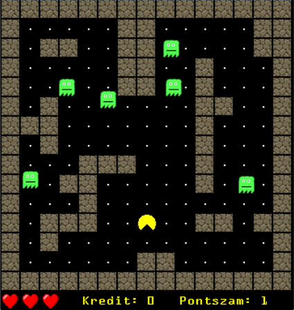
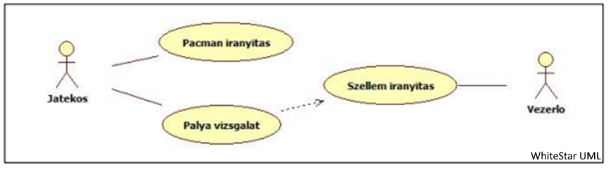

# 2D Pacman (java + swing)
2D pacman game created with java. The GUI is created with swing. (2022)

 

## Rövid ismertető

Pacman játék A játék lényege, hogy a felhasználó, az általa irányított karakterrel összeszedje a pályán lévő összes pontot. A játék akkor ér véget, ha az összes pont fel lett véve vagy ha a játékosnak elfogynak az életei. A játékot ellenfelek (szellemek) nehezítik, akik ugyanúgy a pályán járkálnak. Ha a játékos ütközik egy ilyen szellemmel, az előrehaladása megmarad, de egy életet elveszít a háromból. Ha mind a három élete elveszik, a játékot vesztett és előröl kell kezdeni a játékot. A megszerzett pontokat rangsorba mentjük, amelyek külső szöveges fileban kerülnek mentésre (nem vesznek el, de csak a legjobb 5-öt tároljuk). Nehézség beállítására is lehetőség lesz.

## Use-case-ek

 
> Text that is a quote

### Pacman irányítás

Ennek a use-case-nek az aktorja a Játékos. Főeseménye, hogy a játékos pacmant
jobbra, balra, fel vagy le indítja el. Az események ezen belül a következőek lehetnek
(alternatív forgatókönyvek):

- Egy pont felszedése és hozzáadása a számlálóhoz
  - Minden pont elfogyott, a játékos nyert
- Szellemmel való ütközés esetén egy életet elvesztünk
  - Ha minden élet elfogyott, a játékos vesztett
- Ha pacman falhoz ér megáll

### Pálya vizsgálat

Ennek a use-case-nek is a Játékos az aktorja. Itt az események a következőek:

- A pálya kirajzolása az aktuális állapotnak megfelelően
- A játékos megnézi a kirajzolt pályát

### Szellem irányítás

Ennek a use-case-nak az aktorja a Vezérlő, a szellemeket nem a játékos irányítja. Ez a
use-case biztosítja a szellemek automatikus mozgását a pályán. Tehát a
főforgatókönyv a szörnyek mozgása a pályán. Az események ezen belül a következőek
lehetnek (alternatív forgatókönyvek):

- Ha pacman ütközik egy szörnnyel akkor elveszít egy életet

## Használat a gyakorlatban

A program indításakor megnyílik a játék kezdőképernyője. Ez alap információkat biztosít a felhasználó számára. A legalsó sorban a kezdőképernyőn és a játék folyamán is leáthatjuk a fennmaradó életeink számát szimbolizáló szíveket, a kreditjeink mennyiségét, illetve a pontjaink számát. A kreditszámlálót a C gomb nyomogatásával növelhetjük. Ezt megtehetjük a kezdőképernyőnél és a játék folyamán egyaránt. Egy gombnyomás egy kreditnek felel meg.

A játék nehézsége a következőképpen alakul. A kezdőképernyőn a játékos választhat az 1-es gomb lenyomásával könnyű, vagy a 2-es gomb lenyomásával nehéz játékmódok közül. A könnyű játékmód esetén 3 darab szellem generálódik, pacman és a szellemek is lassan mozognak. Nehéz mód esetén viszont 6 gyorsabb szellem lesz a pályán és pacman sebessége is gyorsabb lesz.  Alapértelmezetten nehézre van állítva a játék. 

A játék indítását a SPACE gomb megnyomásával tehetjük meg. Ehhez szükségünk van legalább egy kreditre. Amennyiben ez rendelkezésünkre áll, egy kredit levonásra kerül és a játék kezdetét veszi. 

Indítás után a játékos célja, hogy összeszedje a pályán található összes golyót úgy, hogy kerüli a szellemekkel való ütközést. Az irányítás a nyilakkal történik. Minden egyes szellemmel való ütközés során a játékos veszít egy életet a háromból.

Amennyiben elfogy mind a három élet, a játéknak vége. Ha a megszerzett pontszám alapján a játékosnak sikerül az eredménylistára kerülnie, a játék megkérdezi a nevét, (nem kötelező megadni) amit kiír a pontszám mellé az eredménylista megfelelő helyére. Ha nem sikerül annyi pontot gyűjteni, hogy felkerüljön az eredménylistára, akkor csak megjelenik az aktuális eredménylista.

Ha sikerül az összes golyót összeszedni a pályán, akkor a játék megkérdezi a játékost, hogy szeretné-e folytatni a játékot. Nem válasz esetén a helyzet hasonló ahhoz mintha vesztettünk volna. A játék bekéri a nevünket, ha sikerül felkerülni az eredménylistára. Abban az esetben ah a játékos szeretné folytatni a játékot a pálya újra generálódik (újra golyó lesz mindenhol) viszont a pontszám megmarad és így folytathatja a pontok gyűjtését.

## Osztályrendszer

A program a következő java fileokat tartalmazza:

| Osztálynév | Funkció |
| --- | --- |
| Eredmeny  | Osztály egy-egy tárolt eredményhez   |
| EredmenyLista   | Osztály az eredménylistához, filekezeléshez   |
| GameListener   | Interface a Tabala és PacmanFoablak kapcsolathoz   |
| PacmanFoablak   | Osztály a játék vége metódusokhoz és main   |
| Tabla   | Osztály a pálya vezérlésére   |

`TODO...`

## Unit tesztek

A JUnit 4 tesztek a JUnitTest source folder-ben található unittest.java file. A következő teszteket futtattam le, amelyek mind sikeresek:

- `public void nevlekerdez()`
	Lekérdezi egy eredmény objektum név adatát. 

- `public void pontlekerdez()`
	Lekérdezi egy eredmény objektum pont adatát. 

- `public void pontbeallit()`
	Beállít egy pontértéket egy eredmény objektumnak.

- `public void osszehasonlit()`
	Összehasonlít két eredmény objektumot, hogy melyik nagyobb vagy egyenlőek. 

- `public void fileBeolvas() throws IOException`
	Megpróbál beolvasni egy ismeretlen filet.

- `public void listaell() throws IOException`
Létrehoz egy üres eredménylistát és egy eredményobjektumot. Megpróbáljuk belerakni az eredményt a listába.

- `public void nehezseg()`
Beállít egy könnyű nehézséget és megnézi, hogy ennek megfelelően változtak-e az értékek.

- `public void labTeszt()`
Megvizsgálja, hogy a játék kezdetén helyesen töltődtek-e át az adatok a labirintus tömbből a módosítható ideiglenesbe.

- `public void jatekvege()`
Egyre állítjuk a megmaradt életeket, majdnem egy szellemmel való ütközést vizsgálunk. Mivel ez volt az utolsó élet a játéknak vége kell hogy legyen.

- `public void eletvesztes()`
Szimulálunk egy játékot, ahol ütközünk egy szellemmel. Megvizsgáljuk, hogy csökkent-e egyel az életek száma.

- `public void kovSzint()`
Megnézzük hogyha megváltoztatjuk a pályát (felveszünk egy golyót) és indítunk egy következő szintet, hogy visszaáll-e alaphelyzetre a pálya és megkaptuk-e a bónusz 50 pontot.

